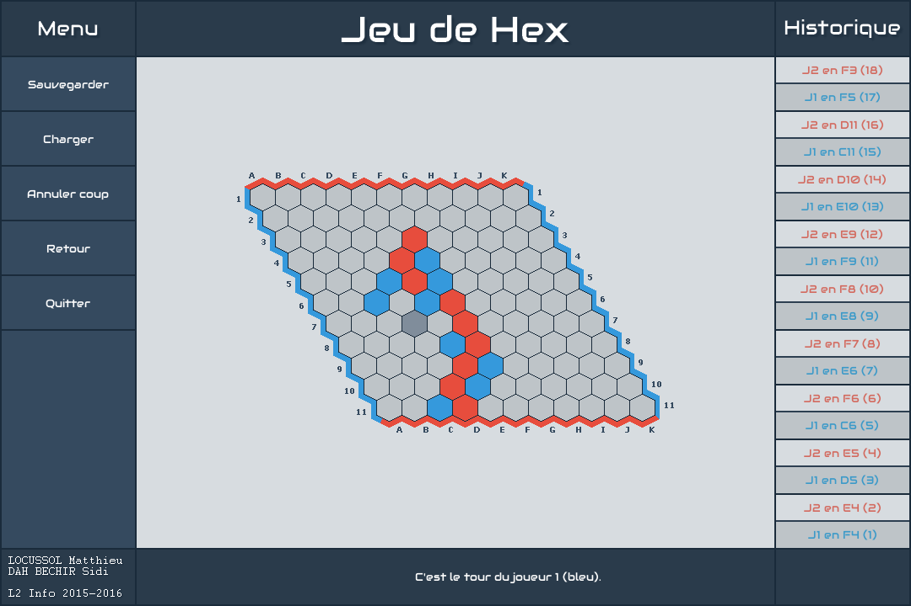

Hex is a strategy board game for two players played on a hexagonal grid. Players alternate placing markers on unoccupied spaces in an attempt to link their opposite sides of the board in an unbroken chain.

*Project carried out as part of my second year at [Paul Sabatier University](http://www.univ-tlse3.fr/).*

## Screenshots

## Features

* Player against player
* Player against AI
* Moves history
* Move cancellation
* Save / load game state
* Switch theme (`F1` / `F2`)

## Dependencies

* [SDL 1.2.15](https://www.libsdl.org/download-1.2.php)
* [SDL_ttf for SDL 1.2.15](https://www.libsdl.org/projects/SDL_ttf/release-1.2.html)
* [SDL_image for SDL 1.2.15](https://www.libsdl.org/projects/SDL_image/release-1.2.html)